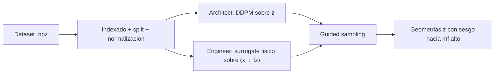

# TFM Shell Research Project

Framework de investigacion para generar cubiertas laminares discretizadas en mallas `64 x 64`, combinando difusion generativa y guiado fisico para sesgar la sintesis hacia respuestas con alto factor membranar (`mf`).

El repositorio implementa un pipeline experimental con tres bloques:

1. Un `architect` difusivo que aprende la distribucion geometrica de `z`.
2. Un `engineer` que aproxima la respuesta mecanica local sobre 13 canales fisicos.
3. Un sampler guiado que inyecta gradientes del `engineer` durante la cadena reverse para empujar las muestras hacia mayor `mf`.

> Nota importante sobre el estado real del codigo
>
> La idea cientifica general del TFM es estudiar generacion estructural condicionada por carga. Sin embargo, en la implementacion actual el `architect` por defecto se entrena como DDPM **no condicionado** sobre `z`: no concatena `fz` ni en entrenamiento ni en muestreo. El condicionamiento por carga entra de forma explicita en el `engineer` y en el sampler guiado, que toma `fz` desde un `.npz` real y usa el surrogate fisico para deformar la trayectoria de denoising.

## 1. Vision global del pipeline



En terminos operativos, el flujo es:

- El `architect` aprende un prior geometrico sobre la variable `z`.
- El `engineer` aprende el operador aproximado `g_phi : (x_t, fz) -> y`, donde `y` contiene desplazamiento, deformaciones, esfuerzos, curvaturas y momentos.
- El sampler genera una muestra inicial gaussiana `x_T`, la pasa por la cadena reverse del `architect` y corrige cada paso usando el gradiente de un objetivo basado en `mf`.

## 2. Estructura del repositorio

```text
TFM/
  artifacts/                         # Figuras, curvas y summaries de cada run
  comparation/                       # Comparacion automatica entre runs de engineer
  configs/                           # Configs YAML de entrenamiento y muestreo
  data/                              # Carpeta opcional para datos dentro del repo
  mlruns/                            # Tracking local de MLflow
  models/                            # Checkpoints, stats, splits e historicos
  src/tfm_shells/
    cli.py                           # CLI unificada
    config.py                        # Carga y resolucion de YAML
    constants.py                     # Orden canonico de canales fisicos
    data/
      dataset.py                     # Dataset y normalizaciones
      index.py                       # Indexado, filtrado y split
    models/
      factory.py                     # Fabrica de modelos + scheduler
      parallel_pb_unet.py            # Engineer baseline: 3 UNets paralelas
      equino.py                      # Engineer con operador espectral + cabezas modales
      shell_weakrefine_operator.py   # Engineer con perdida debil, refinamiento y incertidumbre
    sampling/
      guided.py                      # Muestreo reverse con guiado por gradiente
    training/
      common.py                      # Utilidades compartidas de entrenamiento
      train_architect.py             # Entrenamiento del architect
      train_engineer.py              # Entrenamiento del engineer
    utils/
      io.py
      matplotlib_backend.py
      physics.py                     # Residuo energetico, mf, weak form, masks
      tracking.py                    # Integracion con MLflow
  main.py                            # Entrada CLI generica
  train_architect.py                 # Wrapper fino a la CLI
  train_engineer.py                  # Wrapper fino a la CLI
  sample_guided.py                   # Wrapper fino a la CLI
  pyproject.toml                     # Dependencias y script `tfm-shells`
```

## 3. Dataset y convenciones

### 3.1 Ruta de datos usada por defecto

Las configuraciones del repositorio apuntan por defecto a:

```text
../Datos/processed_image2/processed_image2
```

Es decir: el dataset no vive dentro de `TFM/data/`, sino en la carpeta hermana `Datos/`.

### 3.2 Resumen del dataset actual

Con el dataset actualmente enlazado en esa ruta, el indexador encuentra:

- `6058` muestras `.npz`
- `2400` estructuras `solid`
- `3658` estructuras `hole`
- `mf_mean` global aproximado: `0.67971`
- `mf_mean` minimo observado: `0.27482`
- `mf_mean` maximo observado: `0.99054`

Con la configuracion por defecto `subset: all`, `val_ratio: 0.20` y `seed: 42`, el split queda en:

- `4846` muestras de entrenamiento
- `1212` muestras de validacion

La estratificacion se hace por tipo (`solid`/`hole`) cuando ambos subconjuntos estan presentes.

### 3.3 Formato esperado de cada `.npz`

El codigo espera al menos estos campos:

```text
z, ds, dv, mf, fz, uz,
se11, se22, se12,
sf11, sf22, sf12,
sk11, sk22, sk12,
sm11, sm22, sm12
```

En el dataset actual aparecen tambien otros campos adicionales, por ejemplo:

```text
x, y, fx, fy, ux, uy, se13, se23, se33, sf13, sf23, sf33
```

pero **la implementacion actual no los usa** en entrenamiento ni en muestreo.

### 3.4 Geometria y forma de los tensores

Todas las magnitudes utilizadas por el pipeline estan discretizadas sobre una malla fija:

$$
\Omega_h = \{1, \dots, 64\} \times \{1, \dots, 64\}
$$

y cada campo relevante tiene forma:

```text
(1, 64, 64)
```

Interpretacion de las variables principales:

| Variable | Shape | Significado |
| --- | --- | --- |
| `z` | `1 x 64 x 64` | Geometria escalar de la cubierta |
| `fz` | `1 x 64 x 64` | Carga vertical distribuida |
| `uz` | `1 x 64 x 64` | Desplazamiento vertical |
| `ds` | `1 x 64 x 64` | Elemento de superficie discreto |
| `dv` | `1 x 64 x 64` | Elemento de volumen discreto |
| `mf` | `1 x 64 x 64` | Factor membranar local |
| `seij` | `1 x 64 x 64` | Deformaciones membranares |
| `sfij` | `1 x 64 x 64` | Resultantes o esfuerzos de membrana |
| `skij` | `1 x 64 x 64` | Curvaturas de flexion |
| `smij` | `1 x 64 x 64` | Resultantes o momentos de flexion |

### 3.5 Orden canonico de canales fisicos

El `engineer` trabaja con 13 canales en el orden definido por `src/tfm_shells/constants.py`:

$$
y =
\left[
uz,\;
se11, se22, se12,\;
sf11, sf22, sf12,\;
sk11, sk22, sk12,\;
sm11, sm22, sm12
\right]
\in \mathbb{R}^{13 \times 64 \times 64}
$$

La separacion por ramas es:

- Rama `u`: `1` canal
- Rama `m`: `6` canales
- Rama `f`: `6` canales

## 4. Preprocesado y normalizacion

### 4.1 Normalizacion de geometria y carga

El dataset calcula minimos y maximos globales **solo en train** para `z` y `fz`:

$$
z_{norm} = 2 \cdot \frac{z - z_{min}}{z_{max} - z_{min}} - 1
$$

$$
fz_{norm} = 2 \cdot \frac{fz - fz_{min}}{fz_{max} - fz_{min}} - 1
$$

Por tanto, la malla de entrada se lleva a `[-1, 1]`.

### 4.2 Estandarizacion de canales fisicos

Los 13 canales del `engineer` se normalizan canal a canal usando media y desviacion tipica del split de entrenamiento:

$$
y_{norm}^{(c)} = \frac{y^{(c)} - \mu_c}{\sigma_c}
$$

con:

- `mu_c`: media del canal `c` sobre todos los pixeles del train
- `sigma_c`: desviacion tipica del canal `c` sobre todos los pixeles del train

Es importante porque el `engineer` entrena y valida en espacio normalizado, pero las perdidas fisicas se calculan tras desnormalizar.

## 5. Formulacion matematica del proyecto

### 5.1 Architect: DDPM sobre la geometria `z`

#### Variable modelada

El `architect` toma como variable limpia:

$$
x_0 = z_{norm}
$$

#### Proceso forward

El ruido se inyecta con el `DDPMScheduler` de `diffusers`, con `num_train_timesteps = 1000`:

$$
q(x_t \mid x_0) =
\mathcal{N}\left(
x_t;
\sqrt{\bar{\alpha}_t} x_0,
\left(1 - \bar{\alpha}_t\right) I
\right)
$$

Equivalentemente:

$$
x_t = \sqrt{\bar{\alpha}_t} x_0 + \sqrt{1 - \bar{\alpha}_t}\,\epsilon,
\qquad \epsilon \sim \mathcal{N}(0, I)
$$

#### Parametrizacion entrenada

El modelo usa por defecto:

- `beta_schedule: squaredcos_cap_v2`
- `prediction_type: v_prediction`

De modo que la red aprende una parametrizacion tipo velocidad:

$$
v_\theta(x_t, t)
$$

#### Loss del architect

La perdida del `architect` es una MSE pura respecto al objetivo del scheduler:

$$
\mathcal{L}_{arch}(\theta)
=
\mathbb{E}_{x_0, \epsilon, t}
\left[
\| v(x_0, \epsilon, t) - v_\theta(x_t, t) \|_2^2
\right]
$$

#### Aclaracion critica

En el codigo actual:

- `configs/architect.yaml` fija `in_channels: 1`
- `train_architect.py` llama a `model(z_noisy, timesteps)` sin concatenar `fz`
- `guided.py` llama al `architect` como `architect(x, t_batch)`

Por tanto, el prior aprendido por defecto es mejor interpretado como:

$$
p_\theta(z)
$$

y **no** como un modelo estrictamente condicionado `p_\theta(z \mid fz)`.

### 5.2 Engineer: surrogate fisico sobre la respuesta mecanica

El `engineer` aprende un operador sobre geometria ruidosa y carga:

$$
g_\phi : (x_t, fz_{norm}, t) \mapsto y_{norm}
$$

donde `y_norm` tiene 13 canales.

Cuando `include_fz_channel: true`, la entrada se construye como:

$$
input_{eng} = \operatorname{concat}(x_t, fz_{norm})
\in \mathbb{R}^{2 \times 64 \times 64}
$$

Si `include_fz_channel: false`, la entrada se reduce a `x_t`.

### 5.3 Familias de modelos soportadas para el engineer

#### A. `parallel_pb_unet`

Baseline del proyecto. Usa tres `UNet2DModel` independientes:

$$
\hat{y}_u = U_\phi(x_t, fz_{norm}, t)
$$

$$
\hat{y}_m = M_\phi(x_t, fz_{norm}, t)
$$

$$
\hat{y}_f = F_\phi(x_t, fz_{norm}, t)
$$

y la salida total es:

$$
\hat{y} = \operatorname{concat}(\hat{y}_u, \hat{y}_m, \hat{y}_f)
$$

#### B. `equino`

Modelo operator-like con:

- proyeccion inicial `1x1`
- bloques espectrales en Fourier (`rfft2`)
- embedding de tiempo sinusoidal
- cabezas por ramas con componente local y componente modal de bajo rango

Es util para explorar si un operador espectral comparte mejor informacion global que una UNet clasica.

#### C. `shell_weakrefine_operator`

Modelo operator-like mas sofisticado, con:

- tronco espectral compartido
- decodificadores por ramas
- cabeza de incertidumbre `log_variance`
- soporte para perdida en forma debil
- soporte para active refinement espacial

### 5.4 Loss supervisada del engineer

Si el modelo no predice incertidumbre, la perdida supervisada es:

$$
\mathcal{L}_{sup}(\phi) =
\mathbb{E}
\left[
\| \hat{y}_{norm} - y_{norm} \|_2^2
\right]
$$

Si el modelo expone `log_variance` y `uncertainty_weighting: true`, la implementacion usa una perdida heterocedastica por pixel:

$$
\mathcal{L}_{het} =
\frac{1}{2}
\mathbb{E}
\left[
\exp(-s)\,(\hat{y}_{norm} - y_{norm})^2 + s
\right]
$$

donde:

$$
s = \log \sigma^2
$$

Ademas, el entrenamiento registra metricas por ramas en espacio normalizado:

$$
\mathcal{L}_{uz} = \operatorname{MSE}(\hat{u}_z, u_z)
$$

$$
\mathcal{L}_{mem} = \operatorname{MSE}(\hat{y}_{mem}, y_{mem})
$$

$$
\mathcal{L}_{flex} = \operatorname{MSE}(\hat{y}_{flex}, y_{flex})
$$

Estas metricas no sustituyen a la loss total, pero ayudan a saber si el modelo aprende peor desplazamiento, membrana o flexion.

### 5.5 Desnormalizacion de fisica

Para aplicar restricciones energeticas, la prediccion se desnormaliza:

$$
\hat{y}_{real}^{(c)} = \hat{y}_{norm}^{(c)} \sigma_c + \mu_c
$$

### 5.6 Energia membranar, energia de flexion y trabajo externo

Una vez desnormalizada la salida del `engineer`, se separan las magnitudes:

- Membrana:
  - `se11, se22, se12`
  - `sf11, sf22, sf12`
- Flexion:
  - `sk11, sk22, sk12`
  - `sm11, sm22, sm12`

Las densidades energeticas discretas implementadas son:

$$
w_{memb} =
\left(sf11 \cdot se11 + sf22 \cdot se22 + 2\,sf12 \cdot se12\right)\, ds
$$

$$
w_{flex} =
\left(sm11 \cdot sk11 + sm22 \cdot sk22 + 2\,sm12 \cdot sk12\right)\, ds
$$

$$
w_{ext} = fz \cdot uz \cdot dv
$$

El balance energetico por muestra se evalua como:

$$
\Delta P =
\sum_{\Omega_h} w_{memb}
+ \sum_{\Omega_h} w_{flex}
- \sum_{\Omega_h} w_{ext}
$$

y el residuo fisico escalar es:

$$
\mathcal{L}_{phys} = (\Delta P)^2
$$

### 5.7 Ponderacion temporal del residuo fisico

El `engineer` no ve `x_0`, sino `x_t`. Para no imponer con la misma intensidad la fisica en todos los niveles de ruido, el codigo usa:

$$
\omega(t) = \left(1 - \frac{t}{T}\right)^p
$$

donde:

- `T = 1000`
- `p = training.timestep_power`

La contribucion fisica total por batch se pondera por:

$$
\mathbb{E}\left[\omega(t)\,\mathcal{L}_{phys}\right]
$$

### 5.8 Warmup por epoca

La intensidad de la regularizacion fisica no entra de golpe. La implementacion usa un warmup por epoca:

$$
\lambda_{phys}(e) =
\begin{cases}
0, & e < e_{warmup} \\
\lambda_{max} \cdot progress(e), & e \ge e_{warmup}
\end{cases}
$$

con `progress(e)` saturado entre `0` y `1`.

### 5.9 Forma debil del residuo

Solo se activa en configuraciones como `engineer_shell_weakrefine_operator.yaml`.

Primero se define el mapa residual local:

$$
r(i,j) = w_{memb}(i,j) + w_{flex}(i,j) - w_{ext}(i,j)
$$

Despues se proyecta sobre funciones test seno:

$$
\phi_{pq}(x,y) = \sin(\pi p x)\sin(\pi q y)
$$

para `p, q = 1, ..., m`, donde `m = num_test_modes`.

Cada coeficiente se calcula como:

$$
c_{pq} =
\frac{\sum_{\Omega_h} r(i,j)\,\phi_{pq}(i,j)\,ds(i,j)}
{\sum_{\Omega_h} ds(i,j)}
$$

y la perdida de forma debil es:

$$
\mathcal{L}_{weak} = \operatorname{mean}_{p,q}(c_{pq}^2)
$$

Esta parte no obliga a anular el residual punto a punto, pero si penaliza sus proyecciones modales globales.

### 5.10 Active refinement espacial

Tambien se activa solo en configuraciones que lo habilitan.

El codigo construye una mascara que selecciona los pixeles mas problematicos segun:

- magnitud normalizada del residual energetico
- magnitud normalizada de la incertidumbre predicha

Si denotamos por `R` el score del residual y por `U` el de incertidumbre, entonces el score de seleccion es:

$$
S = w_r \tilde{R} + w_u \tilde{U}
$$

donde `tilde` indica normalizacion espacial a `[0, 1]`.

Luego se conserva el `topk_ratio` de pixeles con mayor score, generando una mascara `M`. Sobre esa mascara se evalua:

$$
\mathcal{L}_{refine}
=
\frac{\sum M \cdot (\hat{y}_{norm} - y_{norm})^2}
{\sum M}
$$

La idea es concentrar capacidad de ajuste donde el surrogate falla mas o donde su incertidumbre es mayor.

### 5.11 Loss total del engineer

En la forma mas general implementada:

$$
\mathcal{L}_{eng}
=
\mathcal{L}_{sup}
+ \lambda_{phys}\,\mathbb{E}[\omega(t)\,\mathcal{L}_{phys}]
+ \lambda_{weak}\,\mathcal{L}_{weak}
+ \lambda_{refine}\,\mathcal{L}_{refine}
$$

Casos concretos:

- `configs/engineer.yaml`
  - usa `parallel_pb_unet`
  - activa perdida supervisada y residuo fisico
- `configs/engineer_equino.yaml`
  - usa `equino`
  - activa perdida supervisada y residuo fisico
- `configs/engineer_shell_weakrefine_operator.yaml`
  - usa `shell_weakrefine_operator`
  - puede activar perdida supervisada, residuo fisico, forma debil y active refinement
  - opcionalmente usa ponderacion por incertidumbre

## 6. Factor membranar

El `mf` local se reconstruye desde la energia relativa de membrana y flexion:

$$
w_{memb}^{local} = sf11 \cdot se11 + sf22 \cdot se22 + 2\,sf12 \cdot se12
$$

$$
w_{flex}^{local} = sm11 \cdot sk11 + sm22 \cdot sk22 + 2\,sm12 \cdot sk12
$$

$$
mf =
\frac{w_{memb}^{local}}
{w_{memb}^{local} + w_{flex}^{local} + \varepsilon}
$$

con:

$$
\varepsilon = 10^{-8}
$$

El codigo hace `clamp` a `[0, 1]`.

Interpretacion:

- `mf ~= 1`: respuesta dominada por membrana
- `mf ~= 0`: respuesta dominada por flexion

En validacion, el `engineer` compara `mf_pred` contra `mf_true` usando `mf_mae`.

## 7. Muestreo guiado por fisica

### 7.1 Idea general

El sampler:

1. Carga un checkpoint de `architect`.
2. Carga un checkpoint de `engineer`.
3. Lee `fz` desde `conditioning.source_file`.
4. Inicializa `x_T ~ N(0, I)`.
5. Recorre la cadena reverse del scheduler.
6. En cada paso, corrige la salida del `architect` con el gradiente de un objetivo basado en `mf`.

### 7.2 Objetivo de guiado

Para cada muestra del batch se calcula el mapa `mf_map` predicho por el `engineer`, se promedia espacialmente:

$$
mf_{mean}^{(b)} = \frac{1}{64 \cdot 64} \sum_{\Omega_h} mf^{(b)}(i,j)
$$

y el objetivo implementado es:

$$
J(x_t) =
\frac{1}{B}
\sum_{b=1}^{B}
\left(1 - mf_{mean}^{(b)}\right)^2
$$

La meta experimental es empujar la trayectoria hacia muestras cuyo `mf_mean` se acerque a `1`.

### 7.3 Renormalizacion entre architect y engineer

Como ambos checkpoints pueden haber sido entrenados con estadisticas distintas, antes de evaluar el `engineer` el sampler transforma la geometria normalizada del `architect` al sistema del `engineer`:

$$
x_t^{eng} = \mathcal{N}_{eng}\left(\mathcal{N}_{arch}^{-1}(x_t)\right)
$$

Esto evita incoherencias cuando `z_min/z_max` de ambos modelos no coinciden.

### 7.4 Gradiente de guiado

El gradiente exacto que usa el codigo es:

$$
g_t = \nabla_{x_t} J(x_t)
$$

y se reescala como:

$$
\tilde{g}_t =
\operatorname{clip}
\left(
w_t \cdot guidance\_scale \cdot g_t,\;
-grad\_clip,\;
grad\_clip
\right)
$$

La salida guiada que entra al `scheduler.step(...)` es:

$$
\tilde{v}_t =
v_\theta(x_t, t)
+ \sqrt{1 - \bar{\alpha}_t}\,\tilde{g}_t
$$

Esta formula es la que esta implementada literalmente en `src/tfm_shells/sampling/guided.py`.

### 7.5 Schedules de guiado disponibles

El peso `w_t` puede seguir dos perfiles:

#### A. Campana gaussiana (`guidance_schedule: bell`)

Si `progress` es la fraccion del camino reverse recorrida:

$$
w_t = w_{max} \cdot
\exp\left(
-\frac{(progress - peak)^2}{2\,width^2}
\right)
$$

Parametros:

- `guide_w_max`
- `bell_peak`
- `bell_width`

#### B. Ley polinomica (`guidance_schedule: poly`)

$$
w_t =
w_{min} + (w_{max} - w_{min}) \cdot progress^{power}
$$

Parametros:

- `guide_w_min`
- `guide_w_max`
- `guide_power`

### 7.6 Detalle importante sobre `source_file`

El archivo indicado en:

```yaml
conditioning:
  source_file: ...
```

se usa solo para leer `fz`. La geometria `z` del archivo **no** se reutiliza como inicializacion del sampler.

## 8. Como ejecutar el proyecto

### 8.1 Requisitos

- Python `>= 3.11`
- `uv`
- Dataset accesible en la ruta indicada por el YAML
- GPU opcional; si no hay CUDA, el codigo cae automaticamente a CPU

Dependencias principales instaladas desde `pyproject.toml`:

- `torch`
- `diffusers`
- `mlflow`
- `numpy`
- `matplotlib`
- `scikit-learn`
- `pyyaml`

### 8.2 Instalacion del entorno

Desde la raiz `TFM/`:

```bash
uv sync
```

No es obligatorio activar la virtualenv si usas `uv run`, pero si quieres hacerlo manualmente en PowerShell:

```powershell
.\.venv\Scripts\Activate.ps1
```

### 8.3 Verificar la ruta del dataset

Revisa las claves `data.dataset_dir` en los YAML de `configs/`. Por defecto apuntan a:

```text
../Datos/processed_image2/processed_image2
```

Si esa carpeta no existe en tu maquina, tienes dos opciones:

1. Mover o enlazar el dataset a esa ruta.
2. Editar el YAML y poner la ruta correcta.

### 8.4 Comando canonico via entrypoint

Tras `uv sync`, el script de consola instalado es:

```bash
uv run tfm-shells architect --config configs/architect.yaml
uv run tfm-shells engineer --config configs/engineer.yaml
uv run tfm-shells sample --config configs/sample_guided.yaml
```

### 8.5 Alternativa via wrappers Python

Los siguientes comandos hacen lo mismo y pueden resultar mas comodos:

```bash
uv run python train_architect.py --config configs/architect.yaml
uv run python train_engineer.py --config configs/engineer.yaml
uv run python sample_guided.py --config configs/sample_guided.yaml
```

### 8.6 Entrenar el architect

Comando:

```bash
uv run python train_architect.py --config configs/architect.yaml
```

Que hace:

1. Indexa el dataset.
2. Filtra por `subset` y `min_mf_mean`.
3. Hace split train/val.
4. Calcula `z_min` y `z_max` del train.
5. Entrena el DDPM sobre `z`.
6. Guarda `best.pt`, `last.pt`, curvas y muestras periodicas.
7. Copia el ultimo run a `models/architect/latest/`.

Outputs esperados:

- `artifacts/architect/<timestamp>_<config>/`
- `models/architect/<timestamp>_<config>/`
- `models/architect/latest/best.pt`

### 8.7 Entrenar el engineer baseline

Comando:

```bash
uv run python train_engineer.py --config configs/engineer.yaml
```

Que hace:

1. Indexa el dataset.
2. Filtra y divide train/val.
3. Calcula estadisticas de `z`, `fz` y de los 13 canales fisicos.
4. Genera ruido `x_t` con el mismo scheduler DDPM.
5. Entrena el surrogate `parallel_pb_unet`.
6. Evalua MSE, residuo fisico y `mf_mae`.
7. Guarda checkpoints, figuras y resumen.
8. Copia el ultimo run a `models/engineer/latest/`.

Outputs esperados:

- `artifacts/engineer/<timestamp>_<config>/`
- `models/engineer/<timestamp>_<config>/`
- `models/engineer/latest/best.pt`

### 8.8 Entrenar variantes del engineer

#### Variante `equino`

```bash
uv run python train_engineer.py --config configs/engineer_equino.yaml
```

Usala si quieres comparar un operador espectral con el baseline de UNets paralelas.

#### Variante `shell_weakrefine_operator`

```bash
uv run python train_engineer.py --config configs/engineer_shell_weakrefine_operator.yaml
```

Usala si quieres activar:

- perdida en forma debil
- active refinement espacial
- incertidumbre heterocedastica

### 8.9 Lanzar muestreo guiado

Antes de ejecutar el sampler, asegurate de que existen:

- `models/architect/latest/best.pt`
- `models/engineer/latest/best.pt`

o cambia las rutas en `configs/sample_guided.yaml`.

Comando:

```bash
uv run python sample_guided.py --config configs/sample_guided.yaml
```

Que hace:

1. Carga el `architect`.
2. Carga el `engineer`.
3. Lee `fz` desde `conditioning.source_file`.
4. Genera un batch de ruido gaussiano.
5. Ejecuta la cadena reverse con guiado por gradiente.
6. Exporta las geometrias finales a `guided_samples.npz`.
7. Exporta figuras con muestras y con la historia temporal del guiado.

Outputs esperados:

- `artifacts/sample/<timestamp>_<config>/guided_samples.npz`
- `artifacts/sample/<timestamp>_<config>/guided_samples.png`
- `artifacts/sample/<timestamp>_<config>/guided_history.png`
- `artifacts/sample/<timestamp>_<config>/summary.json`

### 8.10 Abrir MLflow para inspeccionar runs

Desde la raiz del proyecto:

```bash
uv run mlflow ui --backend-store-uri ./mlruns
```

Despues abre:

```text
http://127.0.0.1:5000
```

Cada run guarda:

- parametros de configuracion
- tamanos de dataset
- curvas por epoca
- artefactos graficos
- checkpoints
- `summary.json`

### 8.11 Comparar automaticamente runs de engineer

El repositorio incluye una utilidad para comparar todos los experimentos guardados en `models/engineer` y `artifacts/engineer`:

```bash
uv run python comparation/compare_ingeniers.py
```

Esto genera reportes en:

```text
comparation/results/<timestamp>/
comparation/results/latest/
```

con tablas, dashboards y un `comparison_report.md`.

## 9. Parametros por defecto mas importantes

### 9.1 `configs/architect.yaml`

| Clave | Valor por defecto | Efecto |
| --- | --- | --- |
| `seed` | `42` | Reproducibilidad del split y del entrenamiento |
| `data.subset` | `all` | Usa `solid + hole` |
| `data.val_ratio` | `0.20` | Reserva el 20% para validacion |
| `data.batch_size` | `16` | Batch del `architect` |
| `model.in_channels` | `1` | El architect ve solo `z_noisy` |
| `model.out_channels` | `1` | Prediccion escalar sobre la geometria |
| `model.prediction_type` | `v_prediction` | Target de difusion tipo velocidad |
| `training.epochs` | `75` | Maximo de epocas |
| `training.learning_rate` | `2e-5` | LR del optimizador AdamW |
| `training.sample_inference_steps` | `1000` | Steps para las muestras periodicas |
| `runtime.device` | `auto` | CUDA si existe; si no, CPU |

### 9.2 `configs/engineer.yaml`

| Clave | Valor por defecto | Efecto |
| --- | --- | --- |
| `seed` | `42` | Reproducibilidad |
| `data.include_fz_channel` | `true` | Concatena `fz_norm` a la entrada |
| `data.batch_size` | `8` | Batch del `engineer` |
| `model.kind` | `parallel_pb_unet` | Baseline de 3 ramas |
| `model.in_channels` | `2` | Entrada `(x_t, fz_norm)` |
| `model.out_channels` | `13` | 13 canales fisicos |
| `training.epochs` | `60` | Maximo de epocas |
| `training.lambda_max` | `1e-3` | Peso maximo del residuo fisico |
| `training.warmup_epochs` | `10` | Warmup de la fisica |
| `training.timestep_power` | `2.0` | Ponderacion temporal `omega(t)` |

### 9.3 `configs/engineer_equino.yaml`

Esta config cambia sobre todo la familia del modelo:

- `model.kind: equino`
- `operator_width: 128`
- `num_operator_layers: 6`
- `spectral_modes_height: 16`
- `spectral_modes_width: 16`
- `modal_rank: 12`
- `modal_residual_weight: 0.25`

### 9.4 `configs/engineer_shell_weakrefine_operator.yaml`

Activa mecanismos adicionales:

- `model.kind: shell_weakrefine_operator`
- `predict_log_variance: true`
- `training.uncertainty_weighting: true`
- `training.weak_form.enabled: true`
- `training.active_refinement.enabled: true`

Valores por defecto destacables:

- `training.lambda_max: 5e-4`
- `training.weak_form.lambda_max: 1e-3`
- `training.active_refinement.lambda_max: 2e-1`
- `training.active_refinement.topk_ratio: 0.20`

### 9.5 `configs/sample_guided.yaml`

| Clave | Valor por defecto | Efecto |
| --- | --- | --- |
| `seed` | `7` | Semilla del muestreo |
| `conditioning.source_file` | `../Datos/.../shell_2600.npz` | Fuente de `fz` |
| `conditioning.batch_size` | `8` | Numero de geometrias a generar |
| `architect.checkpoint` | `models/architect/latest/best.pt` | Prior geometrico |
| `engineer.checkpoint` | `models/engineer/latest/best.pt` | Surrogate fisico usado en el guiado |
| `sampling.num_inference_steps` | `1000` | Longitud de la cadena reverse |
| `sampling.guidance_scale` | `250.0` | Intensidad global del gradiente |
| `sampling.grad_clip` | `5.0` | Saturacion del gradiente |
| `sampling.guidance_schedule` | `bell` | Perfil temporal del guiado |
| `sampling.guide_w_max` | `8.0` | Altura maxima de la campana |
| `sampling.bell_peak` | `0.5` | Centro relativo de la campana |
| `sampling.bell_width` | `0.22` | Anchura del schedule bell |

## 10. Que guarda cada run

### 10.1 En `artifacts/`

Cada run crea una carpeta tipo:

```text
artifacts/<role>/<YYYYMMDD_HHMMSS>_<config_name>/
```

Segun el rol, alli aparecen:

- `config.yaml`
- `stats.json`
- `splits.json`
- `history.csv`
- `summary.json`
- figuras de diagnostico

Ejemplos:

- `architect_curves.png`
- `samples_epoch_010.png`
- `engineer_curves.png`
- `engineer_validation.png`
- `guided_samples.png`
- `guided_history.png`

### 10.2 En `models/`

Cada run guarda:

- `best.pt`
- `last.pt`
- `config.yaml`
- `stats.json`
- `splits.json`
- `history.csv`
- `summary.json`

Despues el codigo replica el ultimo experimento a:

```text
models/<role>/latest/
```

Esto simplifica el sampler, pero tiene una consecuencia importante:

> Cada nuevo entrenamiento sobrescribe semanticamente el alias `latest`.

Si quieres congelar una pareja concreta `architect`/`engineer`, apunta `configs/sample_guided.yaml` a un timestamp especifico en lugar de usar `latest`.

## 11. Notas practicas y caveats

### 11.1 El architect no usa `fz` en la version actual

Esta es la diferencia mas importante entre la intencion metodologica amplia y la implementacion actual. Si en tu memoria quieres afirmar condicionamiento directo del generador por `fz`, tendras que modificar tambien el codigo de entrenamiento y de muestreo del `architect`, no solo el YAML.

### 11.2 `include_fz_channel` no gobierna al architect

La clave `data.include_fz_channel` es relevante para el `engineer`. El `architect` actual no la consume en su loop de entrenamiento.

### 11.3 `num_workers: 0` es una eleccion razonable en Windows

Las configs usan `num_workers: 0`, lo que evita muchos problemas tipicos de `DataLoader` en Windows y simplifica la reproducibilidad local.

### 11.4 El backend de Matplotlib se fuerza a `Agg`

El repositorio fija `MPLBACKEND=Agg` cuando hace falta, asi que puede generar figuras en ejecuciones headless sin depender de una sesion grafica.

### 11.5 El sampler usa `fz` real, pero genera `z` desde ruido

No hace inpainting ni refinement de una geometria existente. Arranca desde ruido gaussiano y usa `fz` solo como senal fisica de guiado.

## 12. Secuencia recomendada para reproducir el experimento

Si quieres ejecutar el proyecto de forma limpia, esta es la secuencia recomendada:

1. Instalar dependencias con `uv sync`.
2. Verificar o corregir `data.dataset_dir` en los YAML.
3. Entrenar el `architect`.
4. Entrenar al menos una variante de `engineer`.
5. Ajustar `configs/sample_guided.yaml` para apuntar al `source_file` y checkpoints deseados.
6. Ejecutar `sample_guided.py`.
7. Abrir MLflow para comparar runs.
8. Si estas comparando familias de surrogate, lanzar `comparation/compare_ingeniers.py`.

## 13. Resumen corto de interpretacion cientifica

La lectura matematica compacta del repositorio actual es:

$$
z_{sample} \sim p_\theta(z)
$$

para el `architect`, y:

$$
\hat{y} = g_\phi(x_t, fz, t)
$$

para el `engineer`, con guiado final:

$$
x_{t-1} = \text{DDPMStep}\left(
x_t,\;
v_\theta(x_t, t) + \sqrt{1-\bar{\alpha}_t}\,\tilde{g}_t
\right)
$$

donde el termino guiado proviene del gradiente de un objetivo que favorece `mf_mean` alto.

En otras palabras:

- el `architect` aporta plausibilidad geometrica,
- el `engineer` aporta sensibilidad mecanica,
- el guiado por gradiente inclina la generacion hacia cubiertas con comportamiento mas membranar.
